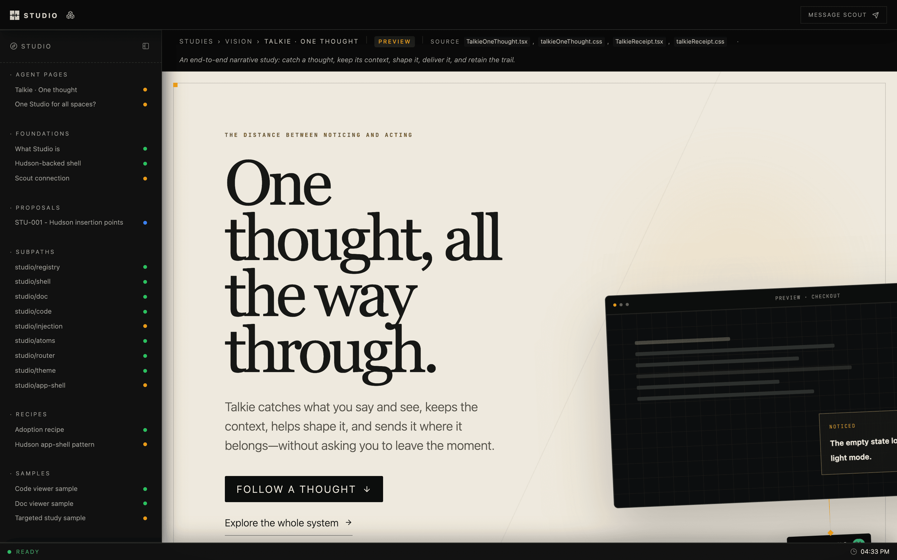

<div align="center">

# Studio

**A design studio that lives in your repo.**

Studies, engineering notes, and working UI experiments, kept beside the code they describe, and open to the agents that help you build it.

<br>



</div>

<br>

## Why

Design work tends to drift away from the product: into Figma files, slide decks, and
threads nobody can find a month later. Studio keeps it in the repository. A study is a
React component, a doc is Markdown, and both sit next to the source they argue about.
They're reviewed in pull requests and rendered with the product's real fonts, tokens,
and components.

## What you get

- **A shell for every product.** Sidebar, page strip, focus mode, a registry of pages
  grouped by your own taxonomy. Built on [Hudson](https://github.com/hudsonkit/hudson).
- **Docs and code, side by side.** A Markdown renderer for engineering docs and a
  read-only CodeMirror viewer, wired to link straight into source files.
- **One URL per project.** `studio dev` gives each repo a stable local host like
  `myapp.studio.local`, so you stop juggling ports.
- **Agents as collaborators.** A local MCP server lets coding agents publish pages
  into your studio and wait for your feedback on them.
- **Flows.** A spatial canvas for whole product journeys, with each screen backed by a
  live design surface.
- **Shareable studies.** Any study becomes a private Claude artifact that reviewers can
  comment on without cloning your repo. Their comments come back into Studio.

## Review studies as Claude artifacts

Most people you want feedback from don't have your repo running. Studio bundles a study
into one self-contained HTML page with React, the compiled CSS and the fonts inline.
Your agent publishes that page as a private [Claude artifact](https://claude.ai), and
you share the link like a document.

```txt
build  →  publish  →  reviewers comment  →  import into Studio  →  reply  →  mirror back
```

Comments on the artifact come back as threaded feedback on the study. Replies you
write in Studio are posted to the same artifact thread. The Studio host never calls
claude.ai: it keeps the bookkeeping and hands your agent a plan through four MCP tools,
and the agent publishes with its own Artifact tools.

```bash
bun src/artifacts/cli.ts build --all   # one HTML page per shared study
studio mcp                              # connect your agent, then ask it to sync artifacts
```

See [Share studies as Claude artifacts](docs/claude-artifacts.md), or the
[live walkthrough](https://hudsonkit.com/studio/foundations/claude-artifacts).

## Quick start

```bash
git clone https://github.com/hudsonkit/studio
cd studio
bun install
bun dev
```

Open [localhost:5191/studio](http://localhost:5191/studio). `apps/studio` is the
first-party studio, and it's built with this package.

> [!NOTE]
> Studio is early and under active development. Today it's developed side by side with
> [hudsonkit](https://github.com/hudsonkit/hudson). Clone `hudson` next to `studio`
> before installing, since the workspace links it from `../hudson`.

## Adding a studio to your product

A studio is an ordinary app route plus a registry of pages:

```txt
app/studio/[[...slug]]/page.tsx   route entry
src/studio/studioRegistry.ts      your sections, statuses, and pages
src/studio/StudioPages.tsx        the studies themselves
docs/                             source docs stay where they are
```

```ts
import { createRegistry } from "studio/registry";

type Bucket = "foundations" | "studies";
type Surface = "web" | "mobile";
type Status = "draft" | "preview" | "stable";

export const registry = createRegistry<Bucket, Surface, Status>({
  pages: [
    {
      href: "/studio/studies/onboarding-v2",
      label: "Onboarding, take two",
      bucket: "studies",
      surface: "web",
      status: "preview",
      source: ["src/studio/studies/OnboardingV2.tsx"],
    },
  ],
  surfaceOrder: ["web", "mobile"],
  defaultSurface: "web",
  bucketLabel: (bucket) => ({ foundations: "Foundations", studies: "Studies" })[bucket],
  surfaceLabel: (surface) => surface,
});
```

Then wrap your dev script so the project gets its own host:

```json
{ "scripts": { "dev": "studio dev --port 3060 -- next dev --port 3060" } }
```

## Packages

| Import | What it's for |
| --- | --- |
| `studio/registry` | Typed page registry for your taxonomy |
| `studio/shell` · `studio/app-shell` | Studio layout, and the Hudson app-shell adapter |
| `studio/doc` · `studio/code` | Markdown docs and the CodeMirror viewer |
| `studio/flows` | Journey canvas, model, renderer, and server |
| `studio/feedback` · `studio/agents` | Reviewer feedback and agent dispatch |
| `studio/injection` | Swap a registered study into the live product |
| `studio/theme` · `studio/atoms` · `studio/router` | Tokens, status pills, router adapters |

## Learn more

- [Docs site](https://hudsonkit.com/studio/docs/): every guide and reference, built with [Dewey](https://github.com/arach/dewey)
- [Claude artifacts](docs/claude-artifacts.md): publish studies for review and sync comments both ways
- [Reference](docs/reference.md): every subpath, the local edge, the host API, and conventions
- [Cloud studios](docs/cloud-studios.md): one host on a VM serving many studios, with an agent working in place
- [Agent dispatch](docs/agent-dispatch.md): routing annotations to coding agents
- [Component registry](docs/component-registry.md): audit and verify gates
- [AGENTS.md](https://github.com/hudsonkit/studio/blob/main/AGENTS.md): the working guide for coding agents in this repo

## Development

```bash
bun test        # full suite
bun run typecheck
```

## License

[Apache-2.0](https://github.com/hudsonkit/studio/blob/main/LICENSE)
